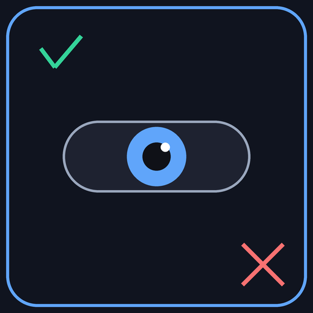

# Proctor

[English](README.md) | [日本語](README.ja.md)

<p align="center">
  
</p>

**Agent Eval — AIエージェントのための試験システム: 軌跡(trajectory)を採点・監査・説明する。**

`Proctor` は**エージェント評価(Agent Eval / LLMOps)ツール**です。記録されたエージェントの軌跡を評価し、ツール呼び出しの正しさを採点し、ループを検出し、計画への準拠をチェックします。そして、他の評価ツールと違い、**エージェントがどこで間違えたのかを特定し、その理由を説明**します。証拠チェーン(evidence chain)と根本原因の分類付きで。

> **Agent Eval** — これは何か: AIエージェントがタスクをどの程度うまく実行したかを測定し、*なぜ失敗したかを診断する*こと。「合格したか」だけでなく、*どこで*・*なぜ*失敗したか。それが「エージェントを信頼する」と「賭ける」の違いです。

> *デモは能力を示し、Eval は信頼を築く* — ただし、*どこで*失敗したかを言える場合に限る。


## なぜこれが存在するか

| ツール | 言語 | できること | ギャップ |
|---|---|---|---|
| **DeepEval** (17.9k★) | Python | エージェント軌跡を採点 | ❌ 失敗を採点するが*位置を特定しない* |
| **AgentRx / TrajDebug** | Python | 因果帰属の研究 | ❌ 研究グレードで製品ではない |
| **Goエコシステム** | Go | — | ❌ この分野に何もない |

`Proctor` = DeepEval のエージェントメトリクスセット(Go実装) + AgentRx/TrajDebug 流の因果帰属を、**サードパーティ依存ゼロ**の単一バイナリとして提供します。

## Proctor が答える問い

エージェントチームが答える必要がある3つの問い — ほとんどの評価ツールは最初の1つにしか答えません:

| 問い | Proctor がどう答えるか |
|---|---|
| **エージェントは正しいことをしたか?** | 8メトリクス: 正しさ、ループ検出、完了、効率、計画品質/準拠… |
| **どこで間違えたか?** | 因果帰属: 失敗したステップを特定、最初の逸脱点へのバックトラック |
| **なぜ?** | 証拠チェーン + 7カテゴリの根本原因(`wrong_tool`, `bad_arguments`, `plan_deviation`, `missing_step`, `redundant_loop`, `insufficient_info`, `unknown`) + 信頼度 |

## 特徴

### メトリクス(8)

| メトリクス | タイプ | 説明 |
|---|---|---|
| `tool_correctness` | 決定的 | 期待ツールセットとの Jaccard 重複、欠落/余分の diff 付き |
| `agent_loop_detection` | 決定的 | 3つのサブシグナル: ツール反復 / 推論停滞 / 呼び出しグラフの循環 |
| `argument_correctness` | LLM judge | 呼び出しごとの引数の妥当性、ステップ単位で特定 |
| `task_completion` | LLM judge | エージェントはタスクを完了したか? |
| `step_efficiency` | LLM judge + 決定的事前チェック | 最小ステップ数 / 冗長な作業 |
| `plan_quality` | LLM judge | 計画は妥当で完全か? |
| `plan_adherence` | LLM judge + weighted-LCS | 実行は計画に従ったか? 最初の逸脱を特定 |
| `tool_use` | LLM judge | 複数ターンのツール選択 + 引数の正しさ |

### 因果帰属(差別化ポイント)
- **失敗した主要ステップを特定**(ステップ索引付き)— 最初の逸脱点へのバックトラック
- **証拠チェーン** — すべての失敗に source・assertion・detail を添付
- **根本原因** — 信頼度付き7カテゴリ
- **因果チェーン** — 順序付けられた失敗ステップ索引
- **決定的ファースト**: LLM なしの帰属が動作。LLM judge はあくまでフォールバック

### Judge の誠実性(LLM-as-a-Judge を正しく)
- **マルチモデル jury** — 多数決による判定パネル(MT-Bench 由来の単一モデルバイアスを緩和)
- **Judge-人間アラインメント**(`align`) — Pearson / Cohen's kappa / accuracy / bias を人間の正解ラベルと比較(「検証者を誰が検証するか」)

### エンジニアリングループ
- **軌跡の取り込み** — OpenAI chat 形式 & LangGraph エクスポート → Sample(記録してから評価、実行時計装なし)
- **レポート** — JSON(`proctor-report/v1`、CI アーティファクト) + Markdown
- **V1 vs V2 diff** — 悪化 / 改善 / 変化なし + 根本原因の変化検出
- **CI ゲート** — `--config gate.yaml`、終了コード 0/1
- **可視化 UI** — 依存ゼロの Web ダッシュボード(バイナリに内蔵)
- **モデル × データセット行列**(`compare`) — 複数モデルを複数データセットで比較、最適を自動選択
- **OpenAI 互換 LLM judge** — 任意のエンドポイントで動作(deepseek、openrouter など)

## クイックスタート

```bash
go build ./cmd/proctor

# 決定的評価(LLM コストゼロ)
./proctor eval --dataset examples/golden.json --format markdown

# LLM-as-Judge メトリクス付き(任意の OpenAI 互換エンドポイント)
export LLM_BASE_URL=https://api.deepseek.com/v1
export LLM_API_KEY=sk-...
export LLM_MODEL=deepseek-chat
./proctor eval --dataset examples/golden.json --format json --out report.json --judge --commit v1 \
  --parallel 4 --cache .cache --rps 10   # 並列・キャッシュ・レート制限

# 可視化
./proctor serve --report report.json --addr 127.0.0.1:8787

# バージョン比較 + CI ゲート
./proctor diff --base v1.json --current v2.json
./proctor gate --current v2.json --config gate.yaml

# Judge-人間アラインメント(データセットに人間ラベルが必要)
./proctor align --dataset golden_labels.json --report report.json

# モデル × データセット行列
./proctor compare \
  --report model=deepseek-flash,dataset=cs:report_a.json \
  --report model=deepseek-pro,dataset=cs:report_b.json
```

終了コード: 全サンプル合格なら `0`、それ以外は `1`(CI ゲートのセマンティクス)。

## 出力例

```
## order_lookup_wrong_tool — FAIL

| Metric | Score | Passed | Reason |
|--------|-------|--------|--------|
| tool_correctness | 0.33 | ❌ | 1/2 expected tools called; missing: search_orders; unexpected: delete_order |

### Attribution
- Root cause: **wrong_tool** (confidence 1.00)
- Causal chain: steps [2]
Key failing steps:
- **Step 2** (tool_call): 1/2 expected tools called; missing: search_orders; unexpected: delete_order
  - `metric:tool_correctness`: ... — score=0.33 step=2
```

## データセット形式

```json
{
  "samples": [
    {
      "name": "order_lookup_ok",
      "input": "Find all orders for user 42",
      "expected_tools": ["get_user", "search_orders"],
      "steps": [
        {"index": 0, "kind": "reasoning", "text": "I need the user record first"},
        {"index": 1, "kind": "tool_call", "tool_call": {"name": "get_user", "args": {"user_id": 42}}},
        {"index": 2, "kind": "observation", "text": "user found: Alice"}
      ]
    }
  ]
}
```

JSONL(`#` コメント可)と**外部軌跡エクスポート**(OpenAI chat-completions メッセージ一覧、LangGraph の node/edge グラフ)も自動検出・変換して受け付けます。

## アーキテクチャ

```
trajectory/   コアデータモデル (Sample, Step, ToolCall, Span) — stdlib のみ
metrics/     メトリクスインターフェース + 決定的エージェントメトリクス
  judge/      LLM-as-Judge 基盤 (Jury, Cache, RateLimit, Meter)
attribution/  因果的失敗帰属 (locate → evidence → root cause)
ingest/       データセット読み込み + OpenAI/LangGraph トレース変換
report/       JSON + Markdown レンダリング、diff、gate
web/          依存ゼロの可視化 UI(内蔵)
llmjudge/     OpenAI 互換 LLM クライアント(stdlib のみ)
cmd/proctor   CLI
```

コアパッケージは**サードパーティ依存ゼロ** — 決定的評価は完全にオフラインで動作します。

## 研究の裏付け

Proctor の judge ベースのメトリクスと帰属手法は、発表済みの研究に基づいています:

| 論文 | 会議 | Proctor が使う点 |
|---|---|---|
| **G-Eval** ([arXiv 2303.16634](https://arxiv.org/abs/2303.16634)) | EMNLP 2023 | LLM-as-a-Judge の原点 — 人間の判断に沿ったルーブリック基盤の採点。6つの judge メトリクスの基盤 |
| **Judging LLM-as-a-Judge with MT-Bench** ([arXiv 2306.05685](https://arxiv.org/abs/2306.05685)) | NeurIPS 2023 | 文書化された judge バイアス(位置/冗長性/自己選好)— Proctor のマルチモデル jury の動機 |
| **Replacing Judges with Juries** ([arXiv 2404.18796](https://arxiv.org/abs/2404.18796)) | 2024 | マルチモデルパネルが単一 judge バイアスを低減 — jury 投票設計 |
| **RAGAS** ([arXiv 2309.15217](https://arxiv.org/abs/2309.15217)) | EACL 2023 | 品質を計算可能なメトリクスに分解 — メトリクス設計の参照 |

### 帰属の系譜

| ソース | Proctor が借用する点 |
|---|---|
| **DeepEval** (confident-ai/deepeval) | 8つのエージェントメトリクスのセマンティクス(ツール正しさ、ループ検出の重み 0.40/0.35/0.25、weighted-LCS 計画準拠) |
| **AgentRx** (microsoft) | 「制約 → チェック → 特定」パイプライン: どのステップがどの制約に違反したか |
| **TrajDebug** (THU-KEG, EMNLP 2026 Findings) | 期待値 vs 実際の diff + 最初の逸脱ステップへのバックトラック、証拠チェーン |

正直な注記: Proctor を定義する単一の論文はありません — judge 手法(G-Eval/MT-Bench)、メトリクスセット(DeepEval)、因果帰属(AgentRx/TrajDebug)の工学的融合であり、さらに LLM コストゼロで動作する決定的ファーストの帰属設計を加えたものです。

## ロードマップ

- [x] M0: 決定的メトリクス + 因果帰属
- [x] M1: judge ベースメトリクス + LLM アダプタ + diff/gate
- [x] M2: 軌跡の取り込み、マルチモデル jury、可視化 UI
- [ ] マルチターゲット比較グリッド(モデル × データセットの行列)
- [ ] AlignMetric(judge vs 人間合意の較正)

## ライセンス

MIT
